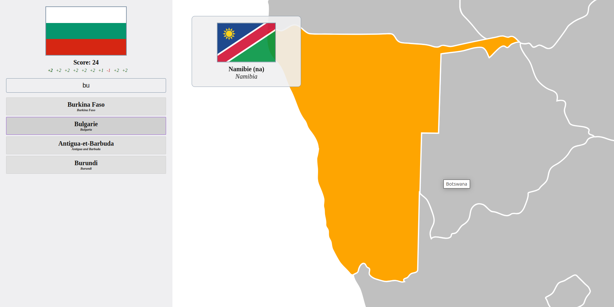

# Flags game

## Public

Available at: https://flags.dewep.net

An online game designed to help users practice identifying world country flags.

*This application was developed as a quick tool for training in the [flagle-game](https://flagle-game.com). It requires a modern browser and is not compatible with mobile devices.*

## Research

The aim of the `research` directory was to find the best flag to use at the start of the flage-game. The idea was to compare each flag with the others, and find the country with the most pixels in common with the others.

The top 3 countries: Lebanon, French Polynesia, and Austria.

But after some thought and several tries, these are not necessarily the best starting countries, as they do not match enough countries, due to their low number of colors. In the case of a country that has no red or white, this type of country gives no information.

Starting with the flag of South Africa seems smarter.
